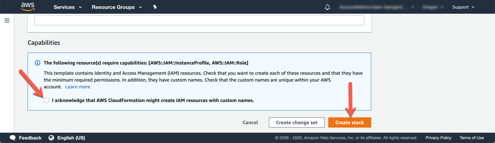

# LAB 환경 구성

1. AWS Console Login - 자신의 AWS IAM 계정으로 Login 합니다. 
`https://console.aws.amazon.com/`

<kbd>  </kbd>

2. Region에서 US West(Oregon) 을 선택

<kbd>  </kbd>

3. 다음의 주소를 복사해서 Browser의 새 창에 Copy and Paste합니다.

`https://console.aws.amazon.com/cloudformation/home?region=us-west-2#/stacks/create/review?stackName=auroralab&templateURL=https://s3.amazonaws.com/ams-stack-prod-content-us-east-1/templates/lab_template.yml&param_deployCluster=Yes`

4. "I acknowledge that AWS CloudFormation might create IAM resources with custom names"를 Check 하고 "Create Stack" Click

<kbd>  </kbd>

**Bucket Name** : `oracle-to-s3-dms-kiwony`

<kbd>  </kbd>