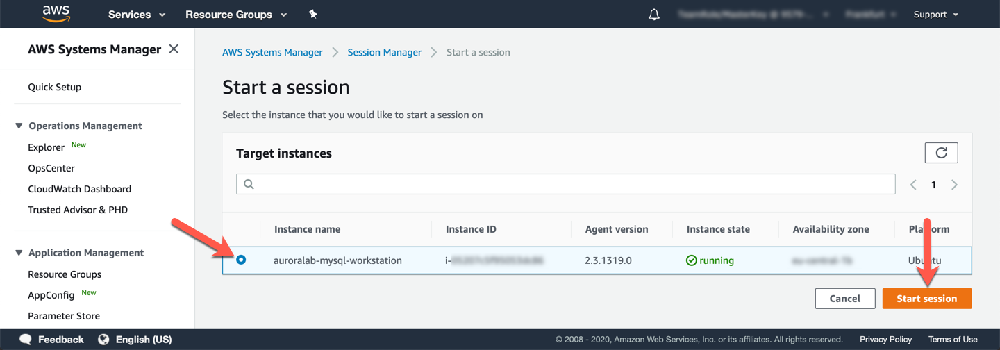
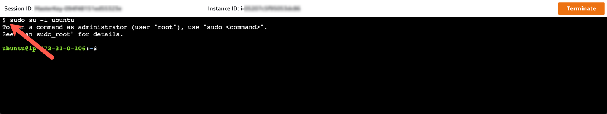

# Session Manager를 이용해서 EC2 인스턴스에 접속

1. 다음의 주소를 복사해서 Browser의 새 창에 Copy and Paste합니다.

`https://us-west-2.console.aws.amazon.com/systems-manager/session-manager?region=us-west-2`

2. "Start Session"을 Click

<kbd>  </kbd>

3. `auroralab-mysql-workstation`을 선택한 후 "Start Session"을 Click

<kbd>  </kbd>

4. Terminal 이 뜨면 `sudo su -l ubuntu`를 통해 ssm-user에서 ubuntu User로 Switching o

<kbd>  </kbd>

5. `tail -n1 /debug.log`를 확인하여 다음의 Log가 있는지 확인 

`* bootstrap complete, rebooting`

