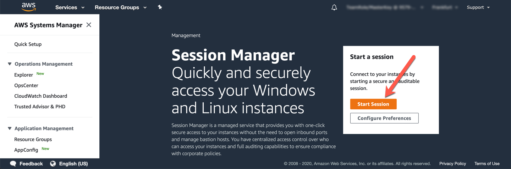

# Session Manager를 이용해서 EC2 인스턴스에 접속

1. 다음의 주소를 복사해서 Browser의 새 창에 Copy and Paste합니다.

`https://us-west-2.console.aws.amazon.com/systems-manager/session-manager?region=us-west-2`

2. "Start Session"을 Click

<kbd>  </kbd>

