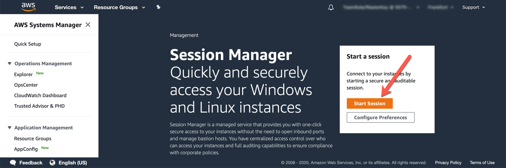

# DB 접속, Data Loading, Auto Scaling 

1. Lab01에서 복사해둔 CloudFormation Output중에 [clusterEndpoint]를 확인합니다. 

2. Session Manager Terminal에서 ubuntu user를 사용하여 다음 명령어로 DB에 접속 합니다. 

`mysql -h[clusterEndpoint] -u$DBUSER -p"$DBPASS" mylab`

3. mysql session에서 다음의 명령어로 Procedure를 생성합니다. 이 Procedure를 사용하여 이후 Step에서 Database에서 부하를 줍니다. 

```
DELIMITER $$
DROP PROCEDURE IF EXISTS minute_rollup$$
CREATE PROCEDURE minute_rollup(input_number INT)
BEGIN
 DECLARE counter int;
 DECLARE out_number float;
 set counter=0;
 WHILE counter <= input_number DO
 SET out_number=SQRT(rand());
 SET counter = counter + 1;
END WHILE;
END$$
DELIMITER ;
```

<kbd>  </kbd>

4. Initial Table을 생성합니다. mysql session에서 다음의 명령어를 수행합니다.

```
DROP TABLE IF EXISTS `sbtest1`;
CREATE TABLE `sbtest1` (
 `id` int(10) unsigned NOT NULL AUTO_INCREMENT,
 `k` int(10) unsigned NOT NULL DEFAULT '0',
 `c` char(120) NOT NULL DEFAULT '',
 `pad` char(60) NOT NULL DEFAULT '',
PRIMARY KEY (`id`),
KEY `k_1` (`k`)
) ENGINE=InnoDB DEFAULT CHARSET=latin1;
```

<kbd>  </kbd>

5. S3에 Data를 다음의 명령어로 Loading 합니다. mysql session에서 다음의 명령어를 수행합니다.
```
LOAD DATA FROM S3 MANIFEST
's3-us-east-1://awsauroralabsmy-us-east-1/samples/sbdata/sample.manifest'
REPLACE
INTO TABLE sbtest1
CHARACTER SET 'latin1'
FIELDS TERMINATED BY ','
LINES TERMINATED BY '\r\n';
```

6. 정상적으로 Loading이 끝났다는 message가 나오면 아래의 명령어로 mysql session에서 나옵니다.

`quit;`

7. "Start Session"을 Click

<kbd>  </kbd>