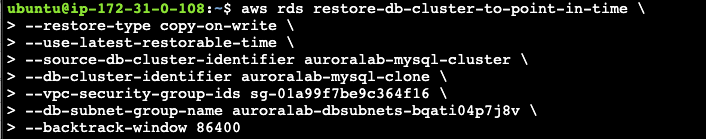
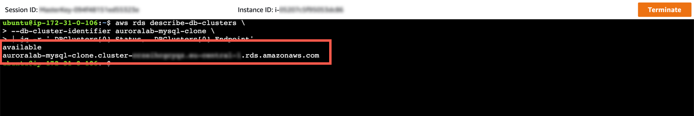
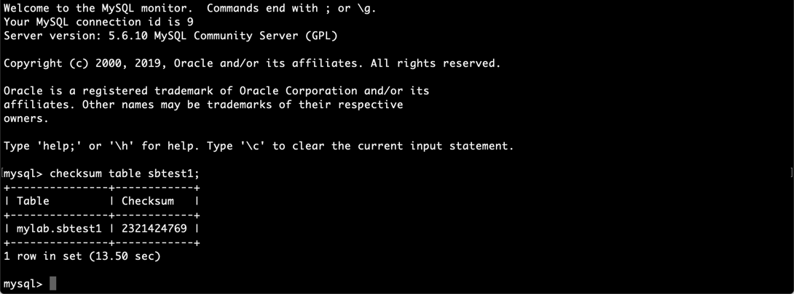
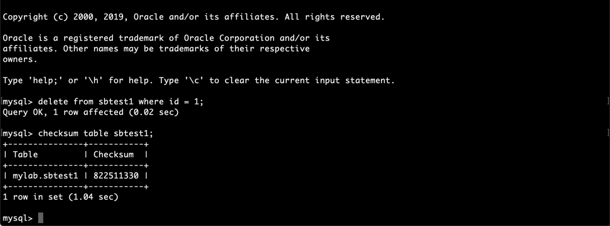

# DB Cloning

1. Session Manager를 이용하여 ubuntu user로 접속합니다.

2. Lab01에서 확인 했던 `dbSecurityGroup`, `dbSubnetGroup`을 확인하고 아래 command에서 수정 후 실행합니다.

```
aws rds restore-db-cluster-to-point-in-time \
--restore-type copy-on-write \
--use-latest-restorable-time \
--source-db-cluster-identifier auroralab-mysql-cluster \
--db-cluster-identifier auroralab-mysql-clone \
--vpc-security-group-ids [dbSecurityGroup] \
--db-subnet-group-name [dbSubnetGroup] \
--backtrack-window 86400
```

<kbd>  </kbd>

3. Cloning 상태를 확인하기 위해 다음의 command를 실행합니다.

```
aws rds describe-db-clusters \
--db-cluster-identifier auroralab-mysql-clone \
| jq -r '.DBClusters[0].Status, .DBClusters[0].Endpoint'
```

4. 아래 화면처럼 Available이라고 나오면 Cloning이 완료 된 것입니다. 2번째 줄에서 Cloning으로 새롭게 생성된 Instance의 Endpoint를 확인 할 수 있습니다.

<kbd>  </kbd>

5. 생성된 Cluster에 DB Instance를 추가합니다.

```
aws rds create-db-instance \
--db-instance-class db.r5.large \
--engine aurora-mysql \
--db-cluster-identifier auroralab-mysql-clone \
--db-instance-identifier auroralab-mysql-clone-instance
```

6. 신규 Instance 생성 상태를 확인하고 available 상태가 되면 7번을 진행합니다.

```
aws rds describe-db-instances \
--db-instance-identifier auroralab-mysql-clone-instance \
| jq -r '.DBInstances[0].DBInstanceStatus'
```

7. 기존 DB Instance와 Cloning된 Instance가 같은지 확인합니다. 다음의 명령어로 Clone된 신규 Instance에 접속합니다. [cluster endpoint of clone]은 3번 Step의 `describe-db-clusters`를 이용하여 확인 가능합니다.

`mysql -h[cluster endpoint of clone] -u$DBUSER -p"$DBPASS" mylab`

8. mysql 접속 후 다음의 명령어로 sbtest1 table의 Checksum을 확인합니다.

`checksum table sbtest1;`

9. 아래의 결과와 유사한 결과가 나오는지 확인합니다.

<kbd>  </kbd>

2-checksum-clone.png

10. `quit`을 이용하여 Cloned Instane의 접속을 종료합니다.

11. 다음의 명령어를 이용하여 원본 Instacne에 접속 합니다. [clusterEndpoint]는 Lab01에서 확인한 Output을 사용합니다.

```
mysql -h[clusterEndpoint] -u$DBUSER -p"$DBPASS" mylab
```

12. 다음의 명령어로 sbtest1 table의 Checksum을 확인합니다.

```
checksum table sbtest1;
```

**원본 DB와 Cloning한 DB가 동일하기 때문에 Checksum 결과가 동일해야 합니다.**

13. `quit`을 이용하여 원본 Instance 접속을 종료합니다.

14. Clone DB에서 Data를 변경 합니다. 아래 명령어로 Clone DB에 접속합니다.

`mysql -h[cluster endpoint of clone] -u$DBUSER -p"$DBPASS" mylab`

15. 다음 명령어로 데이터를 삭제합니다. 그리고 Checksum을 확인합니다.

`delete from sbtest1 where id = 1;`

`checksum table sbtest1;`

16. Clone DB의 sbtest1 Table의 Checksum이 달라짐을 확인합니다.

<kbd>  </kbd>

17. `quit`을 이용하여 Cloned Instane의 접속을 종료합니다.

18. Clone DB의 변경이 원본 DB에 영향을 주지 않음을 확인합니다. 원본 DB에 접속하여 sbtest1의 checksum을 확인합니다.

`mysql -h[clusterEndpoint] -u$DBUSER -p"$DBPASS" mylab`

`checksum table sbtest1;`

**원본 DB의 checksum은 동일함을 확인합니다. 즉 Clone DB의 변경은 원본에 영향을 주지 않음을 확인합니다.**

19. LAB에서 사용한 Clone DB를 삭제합니다.

`aws rds delete-db-instance --db-instance-identifier auroralab-mysql-clone-instance`

`aws rds delete-db-cluster --db-cluster-identifier auroralab-mysql-clone --skip-final-snapshot`

20. 수고하셨습니다. 다음 챕터로 이동하세요. [AuroraLab05.md](AuroraLab05.md)
