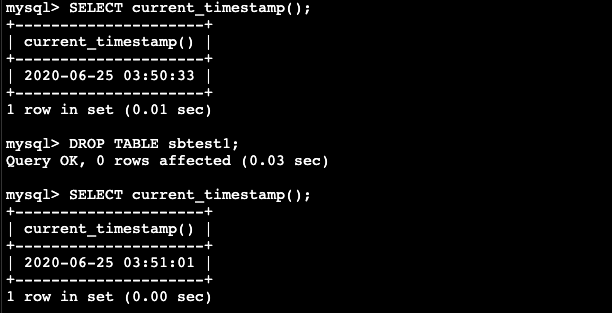
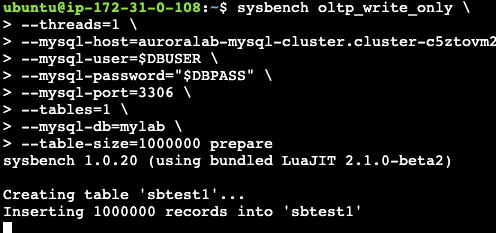
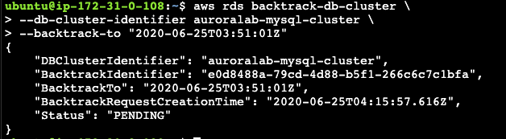
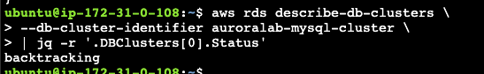
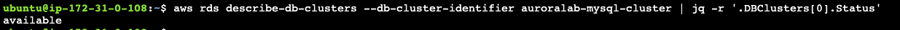

# DB Backtrack

1. 사용자가 실수로 Table을 drop하는 상황을 만듭니다. mysql에 접속을 하고 아래의 명령어들을 수행합니다. 아래 실행 한 결과들을 메모장에 복사합니다. Timestamp를 이용하여 실수로 Drop한 Table을 BackTrack으로 복구 할 것 입니다.

`mysql -h[clusterEndpoint] -u$DBUSER -p"$DBPASS" mylab`

```
SELECT current_timestamp();

**10초 정도 대기**

DROP TABLE sbtest1;

SELECT current_timestamp();

quit;

```

<kbd>  </kbd>

2. 다음의 sysbench command를 이용하여 새로운 `sbtest1` table을 생성하고 data를 넣습니다. [clusterEndpoint]를 변경한 후 실행합니다.

```
sysbench oltp_write_only \
--threads=1 \
--mysql-host=[clusterEndpoint] \
--mysql-user=$DBUSER \
--mysql-password="$DBPASS" \
--mysql-port=3306 \
--tables=1 \
--mysql-db=mylab \
--table-size=1000000 prepare
```

<kbd>  </kbd>

3. DB에 다시 접속하여 `sbtest1` table의 checksum을 확인합니다. 기존 Table의 Drop되고 새로운 Table에 Sysbench를 이용하여 신규 Data를 넣었기 때문에 기존 Checksum과 값이 달라짐을 확인합니다.

```
mysql -h[clusterEndpoint] -u$DBUSER -p"$DBPASS" mylab

checksum table sbtest1;

quit;
```

4. BackTrack을 이용하여 실수로 삭제했던 `sbtest1` table을 복원합니다. 우선 drop 직후의 시점으로 Database를 BackTrack합니다. (drop command 수행 후 확인했던 Timestamp를 이용합니다.)

```
aws rds backtrack-db-cluster \
--db-cluster-identifier auroralab-mysql-cluster \
--backtrack-to "2020-06-25T03:51:01Z"
```

<kbd>  </kbd>

5. Backtrack 상태를 아래의 command로 조회합니다. (BackTrack을 위해 몇 분 정도 소요됩니다.)

```
aws rds describe-db-clusters \
--db-cluster-identifier auroralab-mysql-cluster \
| jq -r '.DBClusters[0].Status'
```

<kbd>  </kbd>

<kbd>  </kbd>

6.
